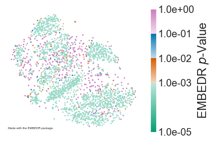

# EMBEDR

Author: Eric Johnson \
Date Created: July 1, 2021 \
Email: eric.johnson643@gmail.com

## Overview

**E**mpirical **M**arginal resampling **B**etter **E**valuates **D**imensionality **R**eduction, or **EMBEDR**, is a method for evaluating the extent to which an embedding generated by a dimensionality reduction algorithm contains structures that are more similar to the structures in the high-dimensional space than we expect by random chance.  The method applies the concept of an empirical hypothesis test, where a null distribution for a sample statistic is generated via marginal resampling, in order to estimate whether samples are better-embedded than a given DRA might do by chance.

For complete details, see our [preprint](https://www.biorxiv.org/content/10.1101/2020.11.18.389031v2).

## Installation

To install EMBEDR, we recommend cloning this repository before installing using `pip` in the main project directory.  Specifically:

```bash
pip install .
```

The package requires numpy, scikit-learn, scipy, conda, and numba for installation.  To generate figures, the seaborn package is required.  Additionally, it is recommended that you ensure that [fftw](https://www.fftw.org/) is installed, otherwise you will not be able to use the fast [FIt-SNE](https://github.com/KlugerLab/FIt-SNE) implementation of the t-SNE algorithm.  You can install fftw using [homebrew](https://formulae.brew.sh/formula/fftw).

## Getting Started

Once you've installed EMBEDR, you can easily generate an embedding colored by EMBEDR *p*-value by calling the `fit` method in the EMBEDR class as below.  

```python
from EMBEDR import EMBEDR, EMBEDR_sweep
import numpy as np

X = np.loadtxt("./data/mnist2500_X.txt").astype(float)

embObj = EMBEDR(project_dir='./')
embObj.fit(X)
embObj.plot()
```



In the example above, we embed 2500 MNIST digits once using t-SNE and we embed a marginally-resampled null data set once as well.  The quality of the data embedding, based on the correspondence between the neighborhoods of each sample in the original space and the shown projection, are compared to those expected to be generated by signalless data (as generated by the null data set).  This comparison results in a "*p*-value," which we use to color the samples in the embedding.  For complete details, see our [preprint](https://www.biorxiv.org/content/10.1101/2020.11.18.389031v2).

The EMBEDR package primarily works through the `EMBEDR` class object, as in the example above.  Importantly, because EMBEDR generates several embeddings of a data set (and a generated null data set), the method stores intermediate results in a project directory.  In the example above, the `project_dir` variable is set to the current working directory, but we recommend that you set a specified "projects" directory.  The default value for `project_dir` is `./projects/`.  To facilitate this organization, a `project_name` parameter can also be specified.  If you don't want to do file caching, set `do_cache=False` when initializing the EMBEDR object.

Other useful parameters are:
- `DRA`: the dimensionality reduction algorithm; currently only `tSNE` and `UMAP` are supported.
- `perplexity`/`nearest_neighbors`: Set the algorithm hyperparameters for t-SNE or UMAP.  Defaults are to set these at 10% of the number of samples.
- `n_data_embed` and `n_null_embed`: The number of data and null embeddings to generate before calculating EMBEDR *p*-values.  Defaults are set at 1, but in practice using 3-10 embeddings is recommended.
For a complete list of options, check the `EMBEDR` class documentation.

## Performing a `perplexity` Sweep

Some of the most powerful results come from using EMBEDR to sweep across scales in the data by embedding data at several hyperparameter values.  This is can be performed in this package using the `EMBEDR_sweep` class.  This class wraps around the EMBEDR

## New in Version 2.0

The updated version of the EMBEDR package better facilitates the EMBEDR algorithm as described in [our manuscript](https://www.biorxiv.org/content/10.1101/2020.11.18.389031v2) by improving the flow of data between stages of the algorithm. In particular, we greatly reduce the number of times that kNN graphs and affinity matrices are calculated; attemping to re-use calculations as often as possible.

This version of the algorithm also supports the sample-wise specification of the `perplexity` and `n_neighbors` parameters, which are common hyperparameters for dimensionality reduction algorithms.

The EMBEDR_sweep object has been implemented.  Users can now execute a sweep over `perplexity` or `n_neighbors`.  Users can also fit a cell-wise optimal t-SNE embedding as in Figure 7 of the manuscript.

## New in Version 2.1

The method now supports UMAP, although not to the same level as t-SNE.  It seems that UMAP will soon be supporting the use of pre-computed kNN graphs, at which point UMAP and t-SNE will be able to be used interchangably.

A bug where EMBEDR objects could only be reloaded from the original path at which they were created has been amended and will be backwards compatible with previous versions.  Objects can now be loaded from any relative path specification for the project directory.


