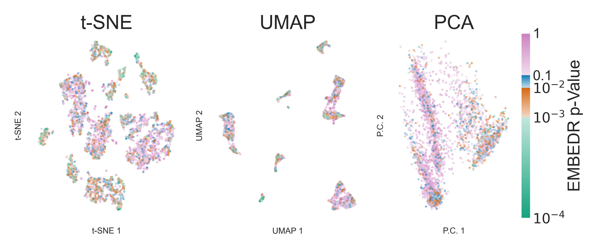

EMBEDR: Statistically Assess Dimensionality Reduction Quality
=============================================================

**E**\ mpirical **M**\ arginal resampling **B**\ etter **E**\ valuates **D**\ imensionality **R**\ eduction (**EMBEDR**) [1]_ is an algorithm for assessing the quality of a data set's embedding via a dimensionality reduction algorithm.  The EMBEDR algorithm works by performing a statistical test for each sample in the data set to evaluate the likelihood that random chance would yield similar levels of structure.

    A visualization of 5037 single cell RNA-seq measurements from mouse tissue [2]_ embedded using t-SNE, UMAP, and PCA and colored using p-values calculated by the EMBEDR algorithm.

Quickstart Usage
----------------

The EMBEDR algorithm is relatively straightforward, but to facilitate usage, we've wrapped the algorithm into a single object, centered on a familiar "fit" method.

.. code:: python
    
    from embedr import EMBEDR

    import matplotlib.pyplot as plt
    import numpy as np

    X = np.loadtxt("./Data/mnist2500_X.txt")

    embedr_obj = EMBEDR(random_state=1,
                        verbose=1,
                        n_data_embed=3,
                        n_null_embed=5,
                        project_name='tSNE_example')
    data_Y = embedr_obj.fit_transform(X)

    ax1 = embedr_obj.plot()
    plt.show()

Notes
-----

The EMBEDR package provided here currently only supports the evaluation of embeddings performed by t-SNE, UMAP, and PCA.  A more complete package that can evaluate arbitrary dimensionality reduction algorithms is currently in development.

The package currently requires `openTSNE <https://opentsne.readthedocs.io/en/latest/>` to work, as well as `numpy`, `matplotlib`, and `scikit-learn`.

Citation
--------

When using our code for your work, please reference our paper!

.. code::

    @article {Johnson389031,
        author = {Johnson, Eric M. and Kath, William and Mani, Madhav},
        title = {A Statistical Approach to Dimensionality Reduction Reveals Scale and Structure in scRNA-seq Data},
        year = {2020},
        doi = {10.1101/2020.11.18.389031v1},
        publisher = {Cold Spring Harbor Laboratory},
        URL = {https://www.biorxiv.org/content/10.1101/2020.11.18.389031v1},
        journal = {bioRxiv}
    }

The current EMBEDR implementation uses openTSNE [3]_ to implement the t-SNE algorithm.  UMAP is implemented using the umap-learn package [4]_.

References
----------

.. [1] Johnson, Eric M., William Kath, and Madhav Mani. `"A Statistical Approach to Dimensionality Reduction Reveals Scale and Structure in scRNA-seq Data" <https://www.biorxiv.org/content/10.1101/2020.11.18.389031v1>`__ BioRxiv (2020)
.. [2] The Tabula Muris Consortium., Overall coordination., Schaum, N. et al. `"Single-cell transcriptomics of 20 mouse organs creates a Tabula Muris." <https://doi.org/10.1038/s41586-018-0590-4>` Nature 562, 367–372 (2018). 
.. [3] Poličar, Pavlin G., Martin Stražar, and Blaž Zupan. `“openTSNE: a modular Python library for t-SNE dimensionality reduction and embedding.” <https://www.biorxiv.org/content/early/2019/08/13/731877>`__ BioRxiv (2019): 731877.
.. [4] McInnes, Leland, John Healy, and James Melville. `"UMAP: Uniform Manifold Approximation and Projection for Dimension Reduction" <https://arxiv.org/abs/1802.03426>`__ arXiv (2020)
